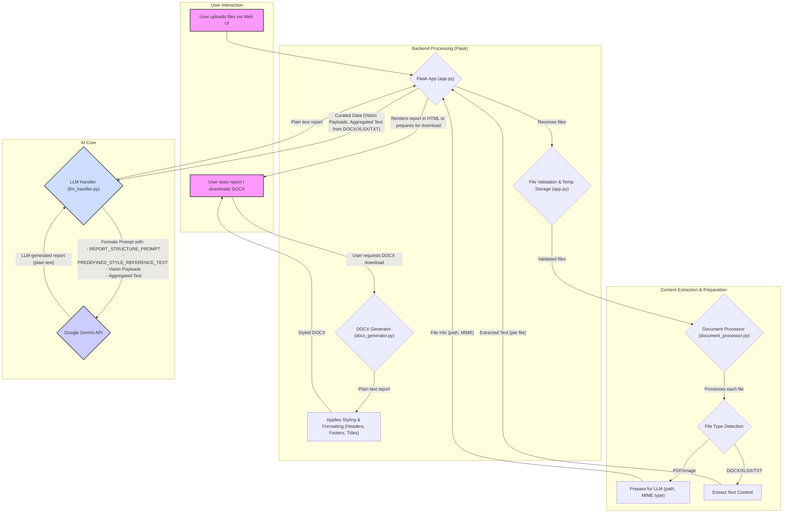

## Explanation of the Flow

1.  **User Upload (A):** The user uploads one or more files (PDFs, images, DOCX, XLSX, TXT) through a web interface.
2.  **Flask App - Entry Point (B):** The `app.py` Flask application (`B`) receives the uploaded files at the `/upload` endpoint.
3.  **File Validation & Temp Storage (C):**
    *   `app.py` (`B`) checks for allowed file extensions (`settings.ALLOWED_EXTENSIONS`) and file size limits (`settings.MAX_FILE_SIZE_BYTES`, `settings.MAX_TOTAL_UPLOAD_SIZE_BYTES`). This is represented by node `C` as a conceptual step within `app.py`'s initial handling.
    *   Valid files are saved to a temporary directory.
4.  **Document Processor (D):**
    *   For each valid file, `app.py` (`B`) calls `document_processor.process_uploaded_file()` (`D`).
5.  **File Type Detection (E):**
    *   `document_processor.py` (`D`) determines the file type (`E`) based on its extension.
6.  **Content Preparation for LLM (F, G & B):**
    *   **PDF/Image (F):** For vision files (PDFs, images), `document_processor.py` prepares a dictionary containing the file's path and MIME type (`F`). This information is returned to `app.py` (`B`).
    *   **DOCX/XLSX/TXT (G):** For text-based files, `document_processor.py` extracts the raw text content (`G`). This extracted text is returned to `app.py` (`B`).
    *   **Data Aggregation in `app.py` (B):** `app.py` collects all vision file information. It also concatenates the extracted text from all DOCX/XLSX/TXT files into a single string (`text_from_other_files`), adding headers/footers to demarcate content from each source file. If this concatenated text exceeds `settings.MAX_EXTRACTED_TEXT_LENGTH`, it's truncated, and a warning is shown to the user.
7.  **LLM Handler - Prompt Assembly (H & B):**
    *   `app.py` (`B`) calls `llm_handler.generate_report_from_content()` (`H`), passing:
        *   The list of all processed file information (which `llm_handler` uses to identify vision files).
        *   The single, concatenated string of text from DOCX/XLSX/TXT files (as `additional_text`).
    *   Inside `llm_handler.py` (`H`):
        *   The prompt for the Gemini API (`I`) is constructed using:
            *   `REPORT_STRUCTURE_PROMPT`: The detailed template for the report structure.
            *   `PREDEFINED_STYLE_REFERENCE_TEXT`: Guidelines for tone, style, and terminology.
            *   **Vision Payloads:** References to the PDF/image files for the LLM to process visually.
            *   **Aggregated Text:** The single string containing all text extracted from DOCX/XLSX/TXT files.
8.  **Google Gemini API Call (I):**
    *   `llm_handler.py` (`H`) sends the fully constructed multimodal prompt to the Google Gemini API (`I`).
9.  **LLM Generates Report (H):** The Gemini model (`I`) processes the input and generates the insurance report content as plain text, which is returned to `llm_handler.py` (`H`).
10. **Display/Download Report (J & B):**
    *   The plain text report from `llm_handler.py` (`H`) is returned to `app.py` (`B`).
    *   `app.py` (`B`) then renders this content in an HTML template (`report.html`) for the user to view (`J`).
    *   If the user chooses to download, `app.py` (`B`) handles this request.
11. **DOCX Generator (K, L):**
    *   Upon a download request (`J`), the `/download_report` route in `app.py` (`B`) receives the plain text report content.
    *   It calls `docx_generator.create_styled_docx()` (`K`).
    *   `docx_generator.py` (`K`) takes the plain text and applies styling, headers, footers, and basic formatting (e.g., bold titles, list indentation) to create the DOCX file (`L`).
    *   The generated DOCX file is sent back through `app.py` (`B`) to the user (`J`) for download.

This flow ensures that various document types are processed, their content is appropriately aggregated and presented to a powerful multimodal LLM along with detailed instructions on structure and style, and the output is then formatted into a professional-looking DOCX report. Potential text truncation for very large combined text documents is a known aspect of the system, communicated to the user via a warning. 